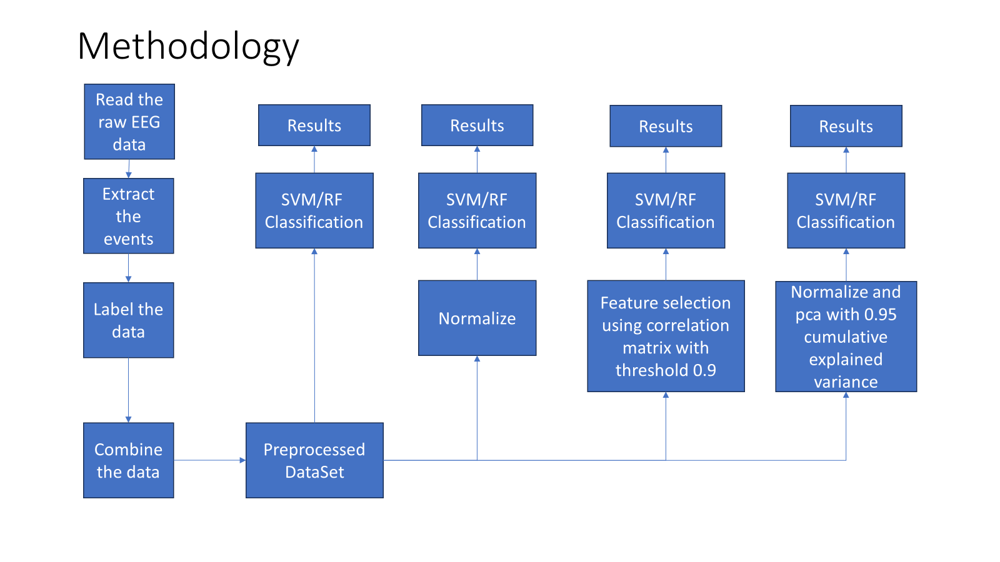

# gamecontroller_eeg

### This project aims to build a model for a game controller that uses brain signals as input.

## Controls
 - left
 - right
 - up
 - down
 - rest

## Dataset used 
  EEG motor/imagery dataset [[1]](#1).
## classifiers used 
  - Support Vector Classifier from SkLearn.
  - Random Forest Classifier from Sklearn.
## methodology

## results
| Metric                              | SVM (real) | SVM (imaginary) | RF (real) | RF (imaginary) |
|-------------------------------------|------------|-----------------|-----------|----------------|
| RAW (actual accuracy)               | 87         | 83              | 81        | 78             |
| Normalized (accuracy)               | 86         | 83              | 81        | 78             |
| Feature selection < 0.9 (accuracy)  | 85         | 77              | 81        | 75              |
| Normalized and PCA (explained variance) | 70    | 67               | 79        | 74              |

- SVM seems to perform better than the random forest classifier.
- Other forms of feature selection and predictability transformation tasks show more data than the imaginary performed.
- Real tasks have shown more predictability than imaginary tasks, but no significant impact in accuracy compared to the RAW data.

## References
<a id="1">[1]</a> : Goldberger, A., Amaral, L., Glass, L., Hausdorff, J., Ivanov, P. C., Mark, R., ... & Stanley, H. E. (2000). PhysioBank, PhysioToolkit, and PhysioNet: Components of a new research resource for complex physiologic signals. Circulation [Online]. 101 (23), pp. e215–e220.
